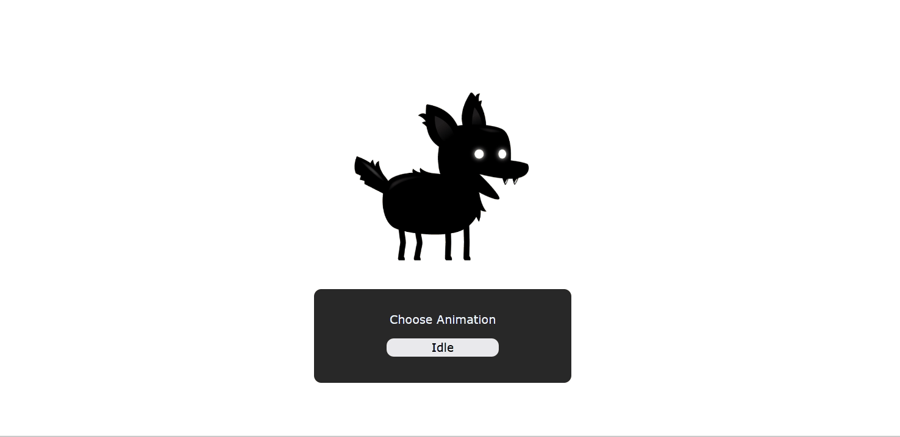

# Learning Sprite Animation
The project of the first video tutorial of JavaScript Game Development Masterclass 2022 by Franks Laboratory.
This is a sprite animation of a dog that can move and do some things. I followed this for learning purposes only. 

## Preview

## What I learned
Utilizing sprite image is very interesting. It's like accessing cutouts of smaller images compressed in one image. Then, looping the cutout images to create an animated motion effect. Over all I gained a clearer grasp of the fundamentals of using Sprite Animation in this tutorial.

## Live Site
Vercel: [Click to see Live Site](https://dog-sprite-animation.vercel.app/)

## Reference 
Sprite Animation in JavaScript by Franks Laboratory 
Youtube Link : [Sprite Animation in JavaScript](https://www.youtube.com/watch?v=CY0HE277IBM&list=PLYElE_rzEw_uryBrrzu2E626MY4zoXvx2&index=1&ab_channel=Frankslaboratory)